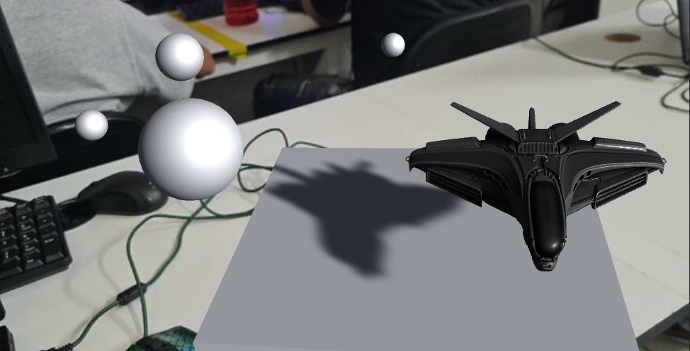
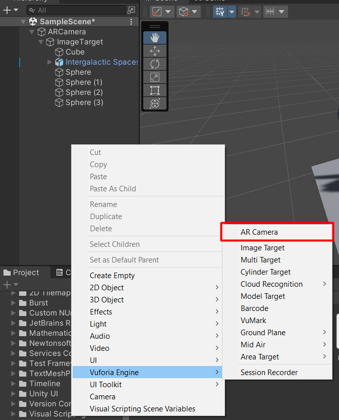

# Mini Projeto RA Unity3D com Vuforia
Esse é um pequeno projeto de estudo de RA (Realidade Aumentada) utilizando Unity3D e Vuforia.

## **Links importantes** para a configuração do ambiente:
[Download Unity 3D](https://unity.com/pt/download)

[Download Vuforia](https://developer.vuforia.com/downloads/sdk)
#
## Preparando o Unity
O primeiro passo para configurar o ambiente é baixar a ferramenta Unity 3D utilizando o primeiro **link importante** na lista disponibilizada no tópico anterior. 

Após criar um projeto base 3D da Unity será necessário baixar os pacotes e realizar as configurações do Vuforia.
#
## Preparando o Vuforia
> Para o download do pacote do Vuforia, é necessário uma conta para poder registrar seua imagem alvo (seu target).

Após baixar o pacote para o Unity do Vuforia no segundo **link importante**, siga o seguinte caminho para adicionar o pacote em seu projeto:
#
### **Com seu projeto 3D aberto**
### **Assets -> Import Package -> Custom Package**
Na aba de seleção de arquivo que será aberta, selecione o pacote do Vuforia que foi baixado anteriormente.
#
## Preparando o cenário
Para o cenário, retire tudo e qualquer elemento que possa existir previamente, assim evitando conflitos.

Do pacote instalado do Vuforia, crie um objeto **AR Camera**:

E crie um **AR Target**, que fica logo abaixo da opção utilizada no passo anterior.