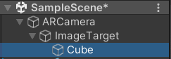
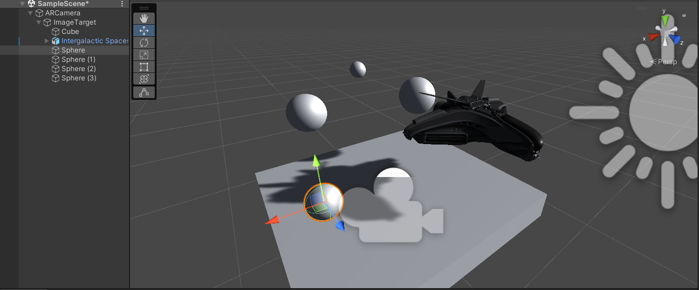

# Mini Projeto RA Unity3D com Vuforia
Esse é um pequeno projeto de estudo de RA (Realidade Aumentada) utilizando Unity3D e Vuforia.


## **Links importantes** para a configuração do ambiente:
[Download Unity 3D](https://unity.com/pt/download)

[Download Vuforia](https://developer.vuforia.com/downloads/sdk)
#
## Preparando o Unity
O primeiro passo para configurar o ambiente é baixar a ferramenta Unity 3D utilizando o primeiro **link importante** na lista disponibilizada no tópico anterior. 

Após criar um projeto base 3D da Unity será necessário baixar os pacotes e realizar as configurações do Vuforia.
#
## Preparando o Vuforia
> Para o download do pacote do Vuforia, é necessário uma conta para poder registrar seua imagem alvo (seu target).

Use a imagem a baixo como alvo (não é necessário ser específicamente essa imagem) .


Após baixar o pacote para o Unity do Vuforia no segundo **link importante**, siga o seguinte caminho para adicionar o pacote em seu projeto:
#
### **Com seu projeto 3D aberto**
### **Assets -> Import Package -> Custom Package**
Na aba de seleção de arquivo que será aberta, selecione o pacote do Vuforia que foi baixado anteriormente.
#
## Preparando o cenário
Para o cenário, retire tudo e qualquer elemento que possa existir previamente, assim evitando conflitos.

Do pacote instalado do Vuforia, crie um objeto **AR Camera**:
> Lembre de configurar qual câmera será utilizada, alterando as configurações dentro do **AR Camera**


E crie um **AR Target**, que fica logo abaixo da opção utilizada no passo anterior.

>Todo o cenário e objetos que serão enviados para RA precisarão estar dentro do **AR Target**
#
## Criando objetos:
Criando um simples cubo e colocando ele dentro do **AR Target**, já teremos um objeto em Realidade aumentada.



#
## Criando scripts:
Crie um script C# chamado "moviment" em uma pasta que será guardado os comportamentos dos objetos e insira o seguinte código:

```javascript
using System.Collections;
using System.Collections.Generic;
using UnityEngine;

public class movement : MonoBehaviour
{

    // Start is called before the first frame update
    void Start()
    {
    }

    // Update is called once per frame
    void Update()
    {
        if(Input.GetAxisRaw("Horizontal") != 0)
        {
            transform.Translate(Input.GetAxisRaw("Horizontal") * 0.01f, 0f, 0f);
        }
        if (Input.GetAxisRaw("Jump") != 0)
        {
            transform.Translate(0f, 0f, Input.GetAxisRaw("Jump") * 0.01f);
        }
        if (Input.GetAxisRaw("Vertical") != 0)
        {
            transform.Translate(0f, Input.GetAxisRaw("Vertical") * 0.01f, 0f);
        }
        if (Input.GetAxisRaw("Fire1") != 0)
        {
            transform.Rotate(0f, 0f, Input.GetAxisRaw("Fire1")* 1f);
        }
    }
}
```

> Lembre de designar o script para o objeto!!!
#
## Reconfigurando teclas
>Para o funcionamento correto desse script, será necessário alterar algumas configurações padrão do Unity.

Siga o caminho a seguir

### **Edit -> Project Settings -> Input Manager**

- **Fire1**: Altere o _Negative Button_ para "x" e _Positive Button__ para "z"
- **Jump**: Altere o _Negative Button_ para "left ctrl" 
#
## Controles:
- Eixo "X": Teclas "A" e "D" ou nas setas para esquerda e da direita;
- Eixo "Y": Teclas Espaço e Ctrl (esquerdo)
- Eixo "Z": Teclas "W" e "S" ou nas setas para cima e para baixo;
- Rotação: Tecla "Z" e "X".
#
## **INFORMAÇÕES ADICIONAIS**
O Unity3D é uma ferramenta muito poderosa, e uma de suas milhares de opções disponíveis, é poder adicionar gravidade e impacto entre objetos utilizando as configurações de corpo rígido (Rigidbody) e os "Colliders", respectivamente.

